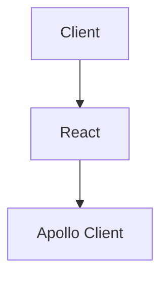
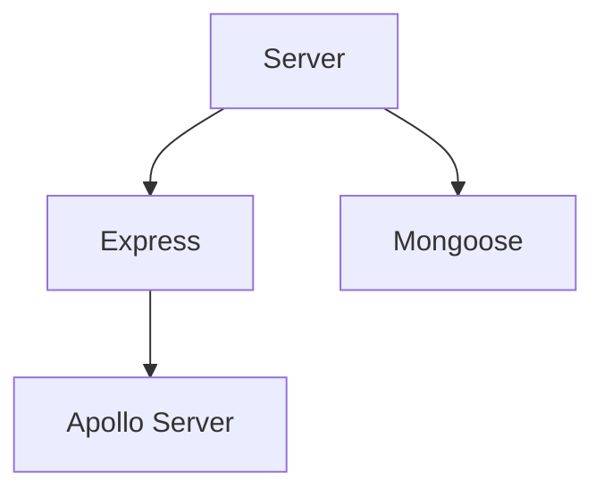

# My blog

## Client
- React
- React Router DOM
- Apollo Client
- Jest
- Enzyme
- Testing Library

## Server
- Express
- Apollo Server

### Diagrams

```mermaid
graph TD
    A[Client] --> B[React] --> C[Apollo Client]
```

```mermaid
graph TD
    A[Server] --> B[Express] --> C[Apollo Server]
    A --> D[Mongoose]
```
